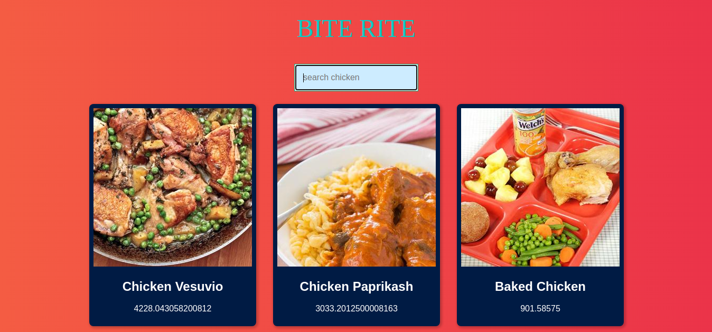

# Redux Capstone

Capstone projects are solo projects at the end of the each of the Microverse Main Technical Curriculum sections. It is a real-world-like project built with business specifications This project was at the end of the React and Redux curriculum section. For this project, I created an app that allows you to make call to a public api and fetch list of chichen. The use of redux was implemented to manage state and and connect the store with the component using the provider method from the redux.

## Live demo

[live demo](https://chicken-app.netlify.app/)

- Screenshot

## Built With

- React
- Redux
- Jest
- Tachyons
- The Edamame API

## Getting Started 

	To get a local copy up and running follow these simple example steps.

## Prerequisites

		Node
		Javascript
		React
		Redux
    npm
		Editor of your choice
		

## Setup

	Clone the repository.
	Run npm install to install dependencies.
	Run npm start to start the development server.
	Your browser should open. Click on the dist folder to see the app.

## Authors

👤 **Ignatius Sani**

- Github: [ignatius22](https://github.com/ignatius22)
- Twitter: [@Iggy_code](https://twitter.com/iggy_code)
- Linkedin: [linkedin](https://www.linkedin.com/in/ignatiussani)

## 🤝 Contributing

Contributions, issues and feature requests are welcome!

Feel free to check the <a href="https://github.com/ignatius22/redux-capstone/issues" target="_blank">issues page</a>.

## Show your support

Give a ⭐️ if you like this project!

## Acknowledgments
 
- <a href="https://www.microverse.org/" target="_blank">Microverse</a>